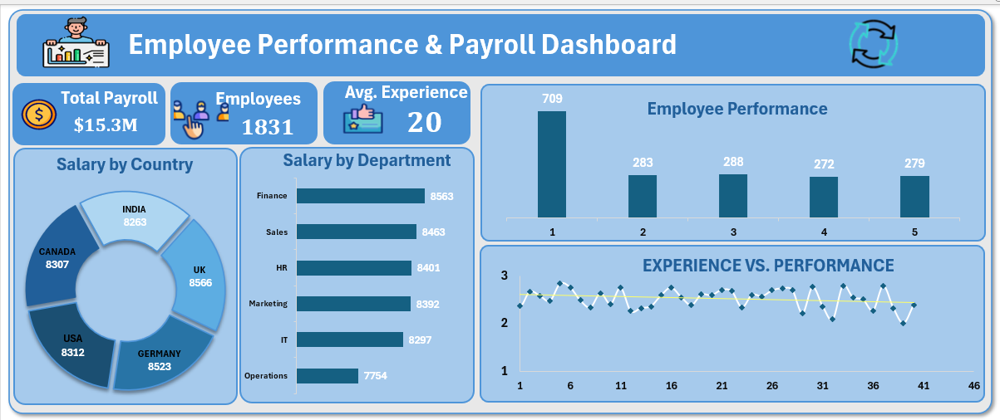

#  Employee Performance Analysis Dashboard — Excel

An interactive HR analytics dashboard built with **Microsoft Excel** to analyze employee performance across departments, countries, and experience levels.

---

##  Dataset Overview

| Column | Description |
|--------|-------------|
| `Employee_ID` | Unique employee identifier |
| `Department` | HR, Sales, IT, Finance, Marketing, Operations |
| `Age` | Employee age |
| `Country` | USA, UK, India, Canada, Germany |
| `Salary` | Monthly salary |
| `Experience_Years` | Years of experience |
| `Performance_Score` | Score from 1 (low) to 5 (high) |

---

##  Key Business Questions Answered

- Which **departments** have the highest performance scores?
- How does **salary** relate to performance and experience?
- Which **countries** have the most high-performing employees?
- What is the **age & experience** distribution across departments?
- Who are the **top performers** in the organization?

---

## 📊 Dashboard Preview

---

##  Tools Used

- **Microsoft Excel**
  - Pivot Tables & Pivot Charts
  - Slicers (interactive filters)
  - Conditional Formatting
  - Data Cleaning & Transformation

---

##  How to Use

1. Download the `.xlsm` file
2. Open with Microsoft Excel (enable macros if prompted)
3. Go to the **Dashboard** sheet
4. Use the **slicers** to filter by department or country

---

##  About

**Eman Salah** — Aspiring Data Analyst  
📌 Excel · Power BI · SQL  
🔗 [LinkedIn](https://www.linkedin.com/in/eman-salah2/) | [GitHub](https://github.com/EmanSalah22)
